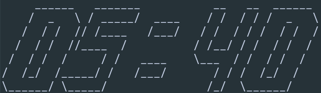

# Pctime

Output the current time to the console

## Installation

```
git clone https://github.com/zalimannard/pcAsciiDigitalClock
cd pcAsciiDigitalClock
makepkg -si
```

## Customization

```
cd ~/.config/ProgrammingChallengeV4/pctime
nvim pctime.txt
```

## Image


